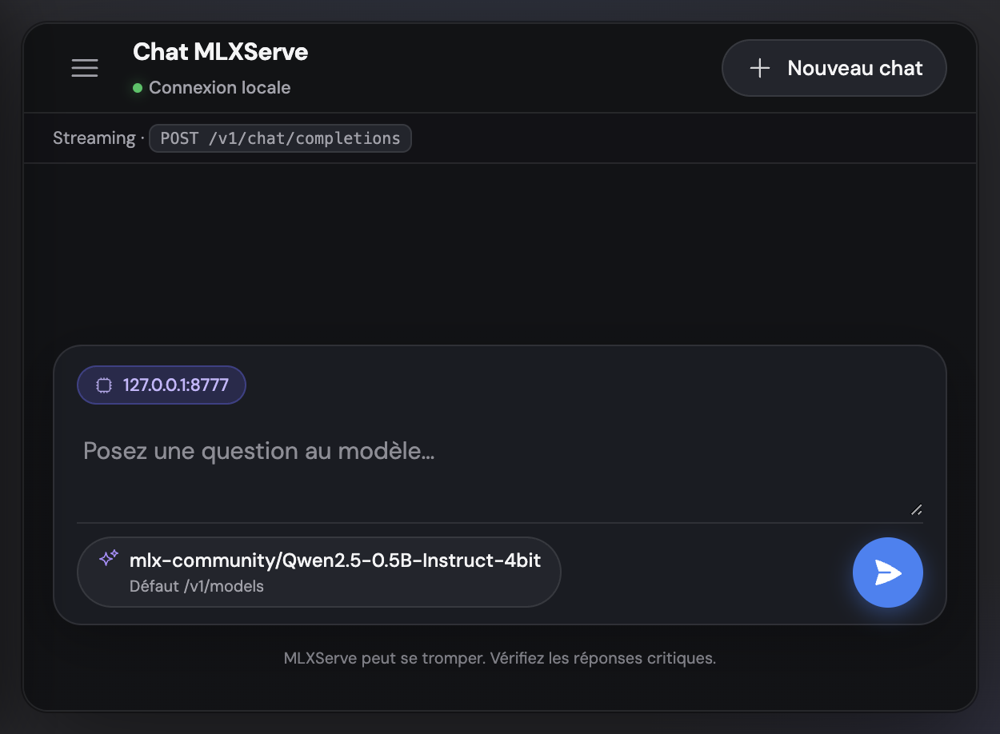
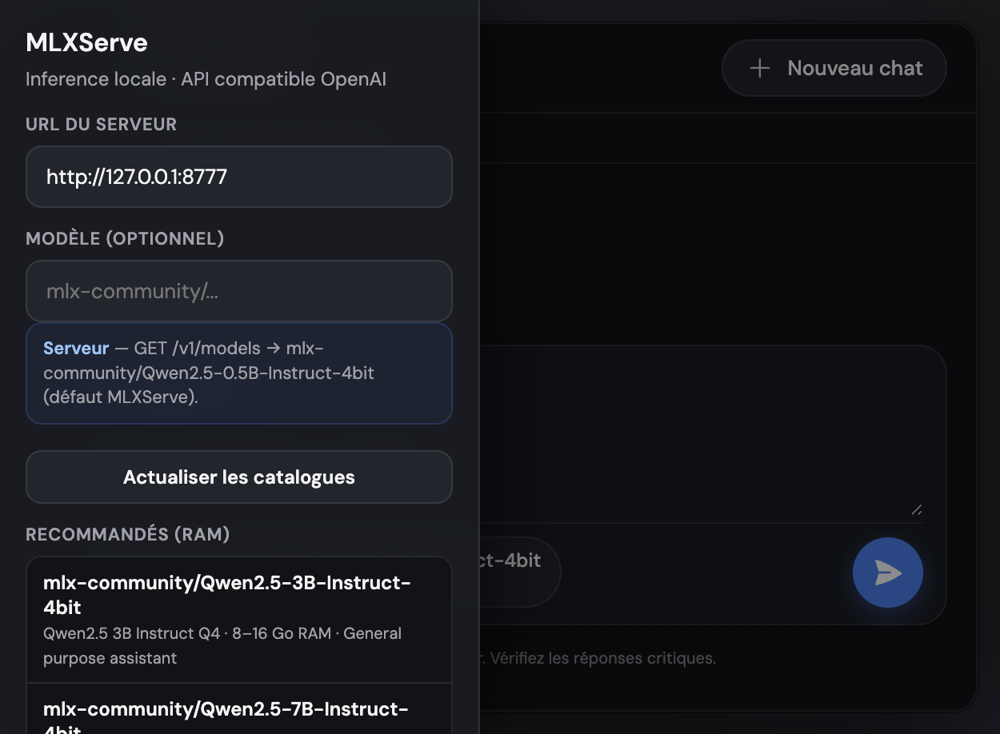

# MLXServe

Serveur d’inférence **[MLX](https://github.com/ml-explore/mlx)** local pour **Apple Silicon**, avec une API **compatible OpenAI** (`/v1/chat/completions`, `/v1/models`, streaming SSE). Pensé pour la stabilité, la mémoire unifiée et des performances correctes sans stack « cloud ».

**Dépôt :** [github.com/ROSITO/SoloMLX-server](https://github.com/ROSITO/SoloMLX-server)

---

## Sommaire

- [Aperçu visuel](#aperçu-visuel)
- [Fonctionnalités](#fonctionnalités)
- [Installation](#installation)
- [Lancer le serveur](#lancer-le-serveur)
- [Interface web](#interface-web)
- [Variables d’environnement](#variables-denvironnement)
- [API : exemples](#api--exemples)
- [CLI](#cli)
- [Performances et autotune](#performances-et-autotune)
- [Modèles (inventory HF)](#modèles-inventory-hf)
- [Sécurité et observabilité](#sécurité-et-observabilité)
- [Documentation](#documentation)
- [Tests](#tests)
- [Comportement chat / sorties « transcript »](#comportement-chat--sorties-transcript)

---

## Aperçu visuel

### Zone de conversation (modèle affiché lisiblement)



### Réglages, catalogue recommandé et modèles locaux



---

## Fonctionnalités

| Domaine | Détail |
|--------|--------|
| **Inférence** | Backend `mlx-lm` (sélection auto ou `stub` pour les tests) |
| **Chat** | `apply_chat_template` + `add_generation_prompt` quand le tokenizer le permet |
| **Streaming** | SSE token par token, paramètres `temperature` / `top_p` |
| **Mémoire** | `MemoryGuardian` (zones green / yellow / red), swap et pression pris en compte |
| **Modèles** | `GET /v1/models`, `recommended`, `local`, `pull`, `delete` |
| **Sécurité** | Clé API optionnelle, rate limit, en-têtes HTTP, CORS configurable |
| **Observabilité** | `GET /metrics` (style Prometheus) |
| **UI** | Page `/` : chat enrichi (blocs code, copie, markdown léger), catalogues API |

---

## Installation

### Environnement Python

```bash
python3 -m venv .venv
.venv/bin/python -m pip install -e ".[dev]"
```

### Runtime MLX (Apple Silicon)

```bash
.venv/bin/python -m pip install -e ".[mlx]"
```

---

## Lancer le serveur

```bash
.venv/bin/mlxserve serve
```

Ou :

```bash
./scripts/start_server.sh
```

Par défaut le serveur écoute sur `127.0.0.1:8080` (voir variables ci‑dessous).

---

## Interface web

Ouvrir dans le navigateur :

```text
http://127.0.0.1:8080/
```

*(Remplacez le port si vous avez défini `MLXSERVE_PORT`.)*

L’UI appelle `POST /v1/chat/completions` en streaming, affiche le **nom de modèle** (y compris depuis un chemin de cache Hugging Face), propose les listes **recommandées** et **locales** via l’API, et rend les blocs de code façon « assistant » moderne.

---

## Variables d’environnement

Préfixe commun : **`MLXSERVE_`**.

| Variable | Rôle | Défaut |
|----------|------|--------|
| `MLXSERVE_HOST` | Adresse d’écoute | `127.0.0.1` |
| `MLXSERVE_PORT` | Port | `8080` |
| `MLXSERVE_API_KEY` | Si non vide, exige `Authorization: Bearer …` (ou JWT si configuré) | *(vide)* |
| `MLXSERVE_JWT_HS256_SECRET` | Si non vide, accepte un JWT HS256 en plus de la clé statique | *(vide)* |
| `MLXSERVE_JWT_AUDIENCE` | Audience attendue du JWT (optionnel) | *(vide)* |
| `MLXSERVE_DEFAULT_MODEL` | Modèle Hugging Face / chemin MLX par défaut | `mlx-community/Qwen2.5-0.5B-Instruct-4bit` |
| `MLXSERVE_RUNTIME_BACKEND` | `auto`, `mlx` ou `stub` | `auto` |
| `MLXSERVE_MAX_MEMORY_GB` | Limite « soft » mémoire (Go) | `14.0` |
| `MLXSERVE_HARD_MEMORY_GB` | Limite « hard » (Go) | `15.0` |
| `MLXSERVE_IDLE_UNLOAD_MINUTES` | Décharge du modèle après inactivité | `15` |
| `MLXSERVE_IDLE_UNLOAD_ENABLED` | `true` / `false` : activer la décharge idle | `true` |
| `MLXSERVE_PRELOAD_DEFAULT_MODEL` | Si `true`, charge `MLXSERVE_DEFAULT_MODEL` au démarrage (évite le cold-start sur la 1ʳᵉ requête ; démarre plus lentement) | `false` |
| `MLXSERVE_MEMORY_ADMISSION_TOKENS_PER_GB` | Heuristique pré-admission : `(prompt+max_tokens)/valeur` → Go estimés | `4500` |
| `MLXSERVE_MEMORY_ADMISSION_CAP_GB` | Plafond de l’estimation pour la zone mémoire | `2.0` |
| `MLXSERVE_MEMORY_ADMISSION_KV_ENABLED` | Ajouter une borne KV conservative à la pré-admission | `true` |
| `MLXSERVE_MEMORY_ADMISSION_KV_MAX_GB` | Plafond Go de l’additif KV dans la pré-admission | `4.0` |
| `MLXSERVE_MEMORY_ADMISSION_KV_LAYERS` | Couches supposées pour l’heuristique KV | `40` |
| `MLXSERVE_MEMORY_ADMISSION_KV_HEADS` | Têtes KV supposées | `8` |
| `MLXSERVE_MEMORY_ADMISSION_KV_HEAD_DIM` | Dimension de tête supposée | `128` |
| `MLXSERVE_MEMORY_ADMISSION_KV_BYTES_PER_ELEMENT` | Octets par élément KV (ex. 2 ≈ fp16) | `2.0` |
| `MLXSERVE_METRICS_LABEL_CHAT_BY_ZONE` | Exposer `mlxserve_chat_completions_labeled_total{memory_zone=…}` | `true` |
| `MLXSERVE_METRICS_LABEL_CHAT_BY_MODEL` | Exposer les compteurs par modèle (cardinalité) | `true` |
| `MLXSERVE_METRICS_MODEL_LABEL_MAX_LEN` | Longueur max du label `model` en Prometheus | `64` |
| `MLXSERVE_MOE_NUM_EXPERTS` | Nombre d'experts pour backend `moe_stub` | `4` |
| `MLXSERVE_MOE_TOP_K` | Top-k experts routés pour backend `moe_stub` | `2` |
| `MLXSERVE_MOE_NUM_SHARED_EXPERTS` | Experts partagés toujours actifs (`moe_stub`) | `1` |
| `MLXSERVE_CORS_ALLOW_ORIGINS` | Origines CORS, séparées par des virgules | `*` |
| `MLXSERVE_RATE_LIMIT_PER_MINUTE` | Plafond de requêtes / fenêtre | `120` |
| `MLXSERVE_PREFILL_STEP_SIZE` | Tuning préfill MLX | `1024` |
| `MLXSERVE_KV_BITS` | Quantification KV | `4` |
| `MLXSERVE_KV_GROUP_SIZE` | Taille de groupe KV | `64` |
| `MLXSERVE_QUANTIZED_KV_START` | Début quantification KV | `32` |

Exemple pour forcer le backend MLX :

```bash
MLXSERVE_RUNTIME_BACKEND=mlx .venv/bin/mlxserve serve
```

---

## API : exemples

### Santé

```bash
curl -s http://127.0.0.1:8080/health
```

### Modèles exposés (OpenAI-compatible)

```bash
curl -s http://127.0.0.1:8080/v1/models
```

Réponse typique :

```json
{
  "object": "list",
  "data": [
    {
      "id": "mlx-community/Qwen2.5-0.5B-Instruct-4bit",
      "object": "model",
      "owned_by": "mlxserve"
    }
  ]
}
```

### Chat (non stream)

```bash
curl -s http://127.0.0.1:8080/v1/chat/completions \
  -H "Content-Type: application/json" \
  -d '{
    "model": "mlx-community/Qwen2.5-0.5B-Instruct-4bit",
    "messages": [{"role": "user", "content": "Bonjour"}],
    "max_tokens": 128,
    "temperature": 0.2
  }'
```

### Chat (stream SSE)

Ajoutez `"stream": true` au JSON ; la réponse est un flux d’événements `data: { ... }` terminé par `data: [DONE]`.

Avec clé API configurée :

```bash
curl -s http://127.0.0.1:8080/v1/chat/completions \
  -H "Content-Type: application/json" \
  -H "Authorization: Bearer VOTRE_CLE" \
  -d '{"messages":[{"role":"user","content":"hi"}],"stream":true,"max_tokens":64}'
```

### Métriques Prometheus

```bash
curl -s http://127.0.0.1:8080/metrics
```

---

## CLI

| Commande | Description |
|----------|-------------|
| `mlxserve` ou `mlxserve serve` | Démarre Uvicorn / FastAPI |
| `mlxserve autotune --model "…" [--max-tokens N]` | Cherche un profil `prefill` / KV plus rapide |
| `mlxserve models-list` | Liste l’inventory locale |
| `mlxserve models-pull --model "org/repo"` | Télécharge et enregistre un modèle |
| `mlxserve models-rm --model "alias"` | Retire de l’inventory + nettoyage cache |

Exemple autotune :

```bash
.venv/bin/mlxserve autotune \
  --model "mlx-community/Mistral-7B-Instruct-v0.3-4bit" \
  --max-tokens 96
```

---

## Performances et autotune

- Streaming réel (pas d’attente de la réponse complète avant envoi).
- Paramètres MLX exposés via l’environnement (`PREFILL_STEP_SIZE`, `KV_*`, etc.).
- Valeurs par défaut actuelles alignées sur un profil raisonnable après autotune (voir `config.py`).

Benchmark rapide « brut » avec `mlx-lm` :

```bash
.venv/bin/python - <<'PY'
from mlx_lm import load, stream_generate
from mlx_lm.sample_utils import make_sampler
import time

model_id = "mlx-community/Qwen2.5-0.5B-Instruct-4bit"
m, t = load(model_id)
sampler = make_sampler(temp=0.2, top_p=0.95)
t0 = time.time()
last = None
for r in stream_generate(
    m, t,
    prompt="bench",
    max_tokens=96,
    sampler=sampler,
    prefill_step_size=1024,
    kv_bits=4,
    kv_group_size=64,
    quantized_kv_start=32,
):
    last = r
print("generation_tps:", round(last.generation_tps, 2), "elapsed:", round(time.time() - t0, 3))
PY
```

---

## Modèles (inventory HF)

Fichier de registre : `~/.mlxserve/models/registry.json`.

| Endpoint | Méthode | Rôle |
|----------|---------|------|
| `/v1/models/local` | `GET` | Modèles suivis + métadonnées |
| `/v1/models/recommended` | `GET` | Suggestions selon la RAM machine |
| `/v1/models/pull` | `POST` | Corps `{"model":"hf/repo"}` |
| `/v1/models/{model_alias}` | `DELETE` | Retrait + tentative de nettoyage cache |

---

## Sécurité et observabilité

- **Rate limiting** par client (fenêtre glissante).
- **En-têtes** : `X-Content-Type-Options`, `X-Frame-Options`, `Referrer-Policy`, `Cache-Control`.
- **CORS** : `MLXSERVE_CORS_ALLOW_ORIGINS`.
- **`/metrics`** : requêtes, erreurs, tokens, latences, zone mémoire, TPS de génération, etc.

---

## Documentation

| Fichier | Contenu |
|---------|---------|
| [docs/README.md](docs/README.md) | Index de la documentation |
| [docs/OPERATIONS.md](docs/OPERATIONS.md) | Démarrage, health, curl, dépannage |
| [docs/REVERSE_PROXY.md](docs/REVERSE_PROXY.md) | Caddy, Cloudflare, Tailscale |
| [docs/CHAT_TRANSCRIPT_OUTPUT.md](docs/CHAT_TRANSCRIPT_OUTPUT.md) | Format chat, anti « roleplay », blocs code |
| [docs/IMPROVEMENTS.md](docs/IMPROVEMENTS.md) | Backlog produit / technique priorisé |
| [docs/GRAFANA.md](docs/GRAFANA.md) | Prometheus / Grafana |
| [docs/INSTALL_HOMEBREW.md](docs/INSTALL_HOMEBREW.md) | Esquisse installation Homebrew |
| [docs/MOE_MLX_ROADMAP.md](docs/MOE_MLX_ROADMAP.md) | Plan Go/No-Go MoE + MLX |
| [docs/BENCH_PHASE1.md](docs/BENCH_PHASE1.md) | Procédure benchmark baseline (phase 1) |
| [docs/MOE_PHASE2_PROTO.md](docs/MOE_PHASE2_PROTO.md) | Proto backend MoE minimal + A/B |
| [docs/RD_DENSE_TO_MOE_PLAN.md](docs/RD_DENSE_TO_MOE_PLAN.md) | Plan R&D Dense -> MoE -> MLX |
| [docs/RD_DECISIONS.md](docs/RD_DECISIONS.md) | Décisions de départ Sprint 1 R&D |
| [docs/RD_SPRINTS_STATUS.md](docs/RD_SPRINTS_STATUS.md) | Suivi exécution des premiers sprints |
| [docs/RD_CONVERSION_RUNBOOK.md](docs/RD_CONVERSION_RUNBOOK.md) | Runbook conversion Dense->MoE réelle |
| [docs/RD_SPRINT3_STABILIZATION.md](docs/RD_SPRINT3_STABILIZATION.md) | Stabilisation MoE (training smoke) |
| [docs/RD_SPRINT4_EVAL.md](docs/RD_SPRINT4_EVAL.md) | Eval A/B Dense vs MoE bridge |
| [docs/RD_SPRINT5_TARGET_TRAINING.md](docs/RD_SPRINT5_TARGET_TRAINING.md) | Entrainement cible court (adapter MoE) |
| [docs/RD_SPRINT6_SCALEUP.md](docs/RD_SPRINT6_SCALEUP.md) | Décision et plan de scale-up 7B |
| [MEMORY.md.example](MEMORY.md.example) | Modèle de notes locales (MEMORY.md est ignoré par git) |
| [docs/screenshots/](docs/screenshots/) | Captures d’écran de l’UI |
| [AGENTS.md](AGENTS.md) | Architecture « agents » du dépôt |
| [MEMORY.md](MEMORY.md) | Notes mémoire / produit (état, limites) |

---

## Tests

```bash
.venv/bin/python -m pytest -q
```

Couverture typique : health, modèles, chat stream / non-stream, sécurité, guardian mémoire, CLI, métriques, UI servie à `/`, sanitisation des sorties.

---

## Comportement chat / sorties « transcript »

Si le modèle renvoie des tours façon `assistant:` / `user:` ou des bribes type `Ass`, voir **[docs/CHAT_TRANSCRIPT_OUTPUT.md](docs/CHAT_TRANSCRIPT_OUTPUT.md)** : le serveur utilise le **chat template** du tokenizer ; l’UI et l’API gardent des garde-fous d’affichage.

---

## Feuille de route (état)

- Phase 0 — Fondations : **fait**
- Phase 1 — API / inférence : **fait**
- Phase 2 — Memory Guardian : **fait**
- Phase 3 — Model Manager : **fait**
- Phase 4 — Sécurité de base : **fait**
- Phase 5 — Observabilité + ops : **fait**

---

## Licence et avertissement

Projet orienté **usage local** sur macOS / Apple Silicon. Les réponses des modèles peuvent être incorrectes : vérifiez les sorties critiques (l’UI l’indique également).
